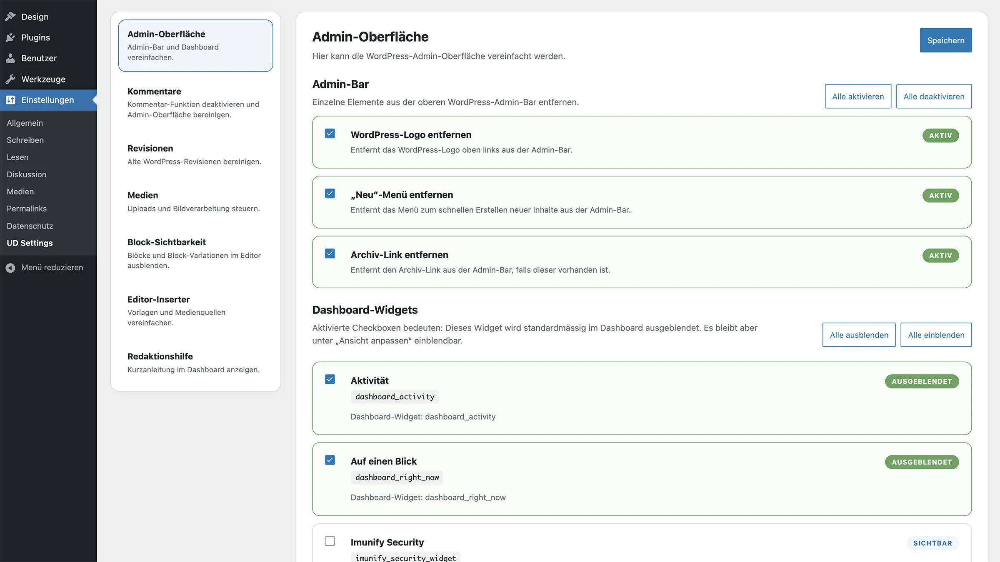

# UD Theme: Blank Block Theme

Block Theme mit `src`-Struktur für SCSS und JavaScript.

## Struktur

```text
src/    → Entwicklung (SCSS, JS)
build/  → kompilierte Assets
```

## Architektur

Das Theme arbeitet mit getrennten Entry Points:

* `frontend` → Frontend
* `editor` → Editor
* `shared` → Frontend und Editor

Diese Struktur gilt für JavaScript (`src/js/`) und SCSS (`src/scss/`).

## Gebündeltes Plugin: UD Settings


*UD Settings bündelt zentrale WordPress-Einstellungen in einer eigenen Admin-Oberfläche.*

**
Das Theme enthält `UD Settings` als vollständige Plugin-Entwicklungsumgebung unter:

```text
bundled-plugins/ud-settings/
```

`node_modules/` wird weder im Theme noch im gebündelten Plugin mitgeführt. Die Abhängigkeiten müssen bei Bedarf im jeweiligen Verzeichnis mit `npm install` neu installiert werden.

`UD Settings` bündelt zentrale WordPress-Projekteinstellungen, die sonst häufig in der `functions.php` eines Themes landen würden. Dadurch bleibt die Theme-Struktur schlanker und wiederverwendbare Grundkonfigurationen können zentral gepflegt werden.

Aktuell enthält das Plugin Einstellungen für:

* **Admin-Oberfläche**
  Vereinfachung der WordPress-Administration, zum Beispiel durch Ausblenden einzelner Admin-Bar-Elemente und Dashboard-Boxen.

* **Block-Sichtbarkeit**
  Steuerung, welche Blöcke und Block-Variationen im Editor zur Auswahl stehen.

* **Kommentare**
  Globale Deaktivierung der Kommentar-Funktion inklusive Admin-Menü, Admin-Bar und Frontend-Ausgabe.

* **Medien**
  Einstellungen für Uploads und Bildverarbeitung, unter anderem SVG-Uploads, maximale Bildgrössen und optionale WebP-/AVIF-Erzeugung.

* **Revisionen**
  Manuelle Bereinigung alter Revisionen mit einstellbarer Anzahl zu behaltender Revisionen pro Inhalt.

Die Einbindung im Theme erfolgt über:

```text
inc/bundled-plugins.php
```

Diese Datei wird in `functions.php` geladen:

```php
require_once get_stylesheet_directory() . '/inc/bundled-plugins.php';
```

## Verwendung nach Download

Nach dem Herunterladen des Themes müssen die Theme-Abhängigkeiten im Theme-Verzeichnis installiert werden:

```bash
npm install
npm run build
```

Beim Aktivieren des Themes wird `UD Settings` aus `bundled-plugins/ud-settings/` nach `wp-content/plugins/ud-settings/` kopiert und aktiviert, sofern es dort noch nicht vorhanden oder aktiv ist.

## Weiterentwicklung

Änderungen am Theme erfolgen in `src/`.

Änderungen am gebündelten Plugin erfolgen in:

`bundled-plugins/ud-settings/`

Wenn am Plugin weiterentwickelt wird, müssen die Plugin-Abhängigkeiten separat im Plugin-Verzeichnis installiert werden:

```bash
cd bundled-plugins/ud-settings/
npm install
npm run build
```

Theme und Plugin haben damit getrennte Entwicklungsumgebungen.

## Autor

[ulrich.digital gmbh](https://ulrich.digital)

## Lizenz

GPL v2 or later
[https://www.gnu.org/licenses/gpl-2.0.html](https://www.gnu.org/licenses/gpl-2.0.html)